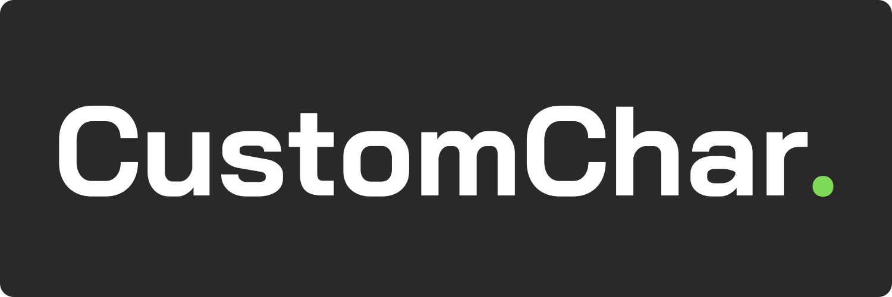

# CustomChar



Your customized AI characters on commodity hardware. This project aims to be a framework to enable the creation of AI characters that can be used in games, simulations, and other applications without depending on a specific platform, cloud servicesm, or specialized hardware.

## Features

- [ ] Build AI characters from knowledge database:
  - [ ] LLamaCpp for LLM
  - [ ] Knowledge indexing and searching
- [ ] Hear from your character:
  - [ ] TTS with bark.cpp
- [ ] Talk to your character
  - [ ] STT with whisper.cpp

## Build

**CustomChar** depends on SDL2 library to capture audio from the microphone. Install SDL2 library before building.

```bash
# Install SDL2 on Linux
sudo apt-get install libsdl2-dev

# Install SDL2 on Mac OS
brew install sdl2
```

Build the **CustomChar** executable:

```bash
mkdir build
cd build
cmake ..
make
```

## Usage

```bash
./try-customchar -mw ../models/ggml-small.en.bin -ml ../models/llama-2-7b-chat.ggmlv3.q4_0.bin -p "User" -t 8
```

- The `-mw` argument specifies the Whisper model that you would like to use. Recommended `base` or `small` for real-time experience
- The `-ml` argument specifies the LLaMA model that you would like to use. Read the instructions in https://github.com/ggerganov/llama.cpp for information about how to obtain a `ggml` compatible LLaMA model

## Session

The `talk-llama` tool supports session management to enable more coherent and continuous conversations. By maintaining context from previous interactions, it can better understand and respond to user requests in a more natural way.

To enable session support, use the `--session FILE` command line option when running the program. The `talk-llama` model state will be saved to the specified file after each interaction. If the file does not exist, it will be created. If the file exists, the model state will be loaded from it, allowing you to resume a previous session.

This feature is especially helpful for maintaining context in long conversations or when interacting with the AI assistant across multiple sessions. It ensures that the assistant remembers the previous interactions and can provide more relevant and contextual responses.

Example usage:

```bash
./try-customchar --session ./my-session-file -mw ../models/ggml-small.en.bin -ml ../models/llama-2-7b-chat.ggmlv3.q4_0.bin -p "User" -t 8
```

## TTS

For best experience, this example needs a TTS tool to convert the generated text responses to voice.
You can use any TTS engine that you would like - simply edit the [speak](speak) script to your needs.
By default, it is configured to use MacOS's `say` or Windows SpeechSynthesizer, but you can use whatever you wish.
