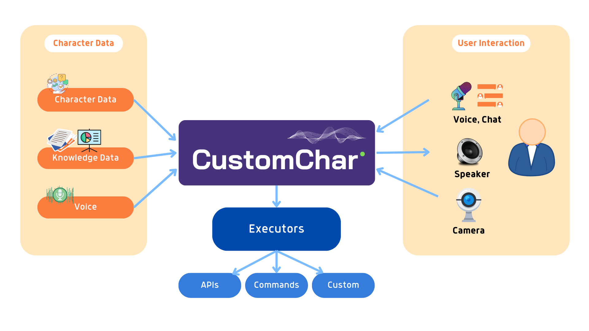

# CustomChar - Your customized AI characters


- **Repository:** [https://github.com/vietanhdev/CustomChar](https://github.com/vietanhdev/CustomChar).
- **Built With:** [GGML](https://github.com/ggerganov/ggml), [llama.cpp](https://github.com/ggerganov/llama.cpp) (LLM, with [LLaMA-v2](https://ai.meta.com/llama/)), [whisper.cpp](https://github.com/ggerganov/whisper.cpp) (speech recognition).

Your customized AI characters - personal assistants on any hardware! This project aims to be a framework to enable the creation of AI characters that can be used in games, simulations, virtual assistants, and other applications without depending on specific platforms, cloud services, or specialized hardware.



**Some of the applications you can build with CustomChar:**

- Game characters that can talk to you and interact with you.
- Your customized virtual assistant. Think about a [JARVIS](https://en.wikipedia.org/wiki/J.A.R.V.I.S.) version on your computer.
- Online education experience with virtual friends/teachers.
- Cloud services that enable users to create their own virtual characters.

**Our very early experiment with CustomChar**

https://github.com/vietanhdev/CustomChar/assets/18329471/b200442f-a69a-42ec-972d-d6cbe5483c37

**Note:** This project is still in the early stage of development. We are working hard to make it available as soon as possible. Star this project 🌟🌟🌟 to follow our progress and encourage us to make it happen.

## 1. Architecture


## 2. Updates

- 🔥 **2023-07-30:** Added OpenCV + camera view.
- 🔥 **2023-07-29:** Added a plugin executor to open apps.
- 🔥 **2023-07-25:** Added UI with Dear ImGui.
- 🔥 **2023-07-23:** Documentation website is online at <https://docs.customchar.com>.
- 🔥 **2023-07-22:** Voice chat with your Llama-V2 model. TTS is supported on MacOS only.

## 3. Features

- [ ] Build AI characters from the knowledge database 💬💬💬 :
  - [x] LLamaCpp for LLM. Chat with **Llama-V2** on **all platforms**.
  - [ ] Knowledge indexing and searching.
- [x] Talk to your character 🎤🎤🎤 :
  - [x] STT with **whisper.cpp**. Now supports speech recognition **on all platforms**.
- [ ] Hear from your character 🔊🔊🔊 :
  - [x] TTS with "say" on MacOS. **Note**: "say" is not available on other platforms (Windows, Linux)
  - [ ] TTS with bark.cpp. Expected to be available on all platforms.
- [x] Plugin executor:
  - [x] Open apps (WIP - Need improvement for Windows and Linux).
  - [ ] Search on Google.
  - [ ] Search on Youtube.
- [ ] Perception engine to see the world through the camera 📷📷📷.
- [x] Add a GUI for the character interaction.
- [ ] Add a GUI for the character creation.
- [ ] Create virtual characters that can be used in games, simulations, and other applications.
  - [ ] Elon Musk
  - [ ] Iron Man
  - [ ] Batman
  - [ ] Superman
- [ ] Add bindings to other languages:
  - [ ] Python
  - [ ] C# (Unity)
  - [ ] Javascript (On-browser)

## 4. Build

Clone the repository:

```bash
git clone https://github.com/vietanhdev/CustomChar --recursive
cd CustomChar
```

Install dependencies:

- [CMake](https://cmake.org/download/)
- C++ 14 compiler

On macOS: Using [Homebrew](https://brew.sh/)

```bash
brew install sdl2 glew glfw3
brew install opencv
```

On Ubuntu:

```bash
sudo apt-get install libsdl2-dev libglew-dev libglfw3-dev
sudo apt-get install libopencv-dev
```

On Windows: Using [vcpkg](https://github.com/microsoft/vcpkg) and [Git Bash](https://git-scm.com/downloads):

```bash
vcpkg install sdl2:x64-windows glew:x64-windows glfw3:x64-windows
vcpkg install opencv[contrib,nonfree,ffmpeg,ipp]:x64-windows --recurse
```

Build the **CustomChar** executable:

```bash
mkdir build
cd build
cmake ..
make
```

## 5. Usage

Download the models before running the program:

```bash
bash scripts/download-models.sh
```

Run the program:

```bash
./customchar
```

## 6. Build documentation

- **Step 1:** Install **doxygen** first.

- **Step 2:** Build the documentation:

```bash
doxygen Doxyfile.in
```

- **Step 3:** Deploy html documentation from `docs/_build/html`.

- **Step 4:** Our latest documentation is deployed at <https://docs.customchar.com>.

## 7. Contribution

We welcome all contributions to this project.

- For coding style, please follow the style of the existing code. We basically follow the [Google C++ Style Guide](https://google.github.io/styleguide/cppguide.html).
- Install [clang-format](https://clang.llvm.org/docs/ClangFormat.html) for auto formatting the code.
- Install [pre-commit](https://pre-commit.com/) for the auto-formatting hook or manually run the script `scripts/format-code.sh` to format the code.

```bash
pre-commit install # Install pre-commit hook
bash scripts/format-code.sh # Format code (C++ styling)
```

## 8. Star history

[](https://star-history.com/#vietanhdev/CustomChar)

## 9. References

- Spinner: <https://github.com/dalerank/imspinner>.
- GGML: <https://ggml.ai/>.
- llama.cpp: <https://github.com/ggerganov/llama.cpp>.
- whisper.cpp: <https://github.com/ggerganov/whisper.cpp>.
- LLaMA-v2: <https://ai.meta.com/llama/>.
